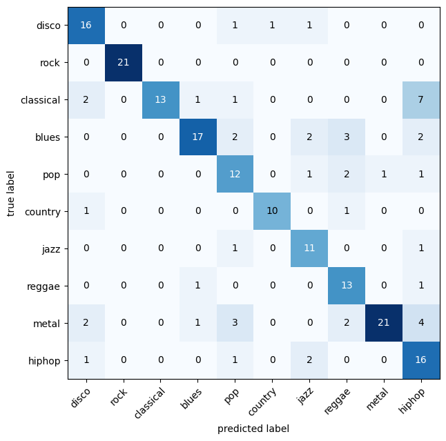

# Music Genre Classification (GTZAN Dataset)

## Project Overview
This project classifies audio tracks into **10 music genres** using **mel-spectrogram images** and deep learning with PyTorch.  

Experimented with multiple pretrained CNN architectures:  
- **EfficientNetB2**  
- **ResNet50**  
- **ResNet34** (best-performing)

The best model, **ResNet34 with unfrozen Layer 3 & 4**, achieves:  
- **Train Accuracy:** 96%  
- **Test Accuracy:** 86%  

---

## 📂 Folder Structure
```
music-genre-classification/
│
├── Data/                                         # Place dataset here (Follows the GTZAN Dataset structure)
│   └── genres_original/                         # 10 subfolders, one per genre, containing audio files
│
├── saved_models/                                 # Trained model checkpoints
│   ├── music_genre_effnetb2_10_epochs.pth
│   ├── music_genre_resnet50_15_epochs.pth
│   └── music_genre_resnet34_15_epochs.pth        # Best model (86% test accuracy)
│
├── results/                                      # Evaluation results
│   └── confusion_matrix.png
│
├── Notebooks/                                    # Reference training notebook
│   └── music_genre_classification.ipynb
│
├── data_setup.py                                 # Dataset and DataLoader setup
├── engine.py                                     # Training & evaluation loops
├── models.py                                     # Model creation functions
├── train.py                                      # Main training script
├── utils.py                                      # Utilities (saving, plotting, etc.)
├── requirements.txt                              # Dependencies
└── README.md

```

---

## Setup & Installation
Clone the repo and install dependencies:

```bash
git clone https://github.com/udaysol/music-genre-classification.git
cd music-genre-classification
pip install -r requirements.txt
```

---

## Dataset

This project used the **GTZAN dataset** available on Kaggle:
[GTZAN Dataset - Music Genre Classification](https://www.kaggle.com/datasets/andradaolteanu/gtzan-dataset-music-genre-classification)

Structure after extraction:

```
Data/genres_original/
├── blues/
├── classical/
├── country/
├── disco/
├── hiphop/
├── jazz/
├── metal/
├── pop/
├── reggae/
└── rock/
```

---

## Training

Run training with:

```bash
python train.py
    or
py train.py
```

This will:

* Prepare dataset and dataloaders
* Train chosen model (default: **ResNet34**)
* Save best checkpoint in `saved_models/`
* This will also save a `dataset.csv` file containing filepaths of dataset audio files along with their class labels

You can also experiment with other models:

* To use **ResNet50** or **EfficientNetB2**, edit `train.py` and replace the model creation line with the corresponding function from `utils.py`.
* You can also define and train your **own custom model** by adding a function in `utils.py` and calling it in `train.py` or directly defining it in the `train.py`.

---

## Results

* **ResNet34 (layer3 & layer4 unfrozen, dropout 0.5)**

  * Train Acc: **96%**
  * Test Acc: **86%**

Confusion Matrix (`results/confusion_matrix_resnet34.png`):


---

## 🧪 Experiments

| Model          | Train Acc | Test Acc |
| -------------- | --------- | -------- |
| EfficientNetB2 | \~77%     | \~70%    |
| ResNet50       | \~95%     | \~76%    |
| **ResNet34**   | **96%**   | **86%**  |

